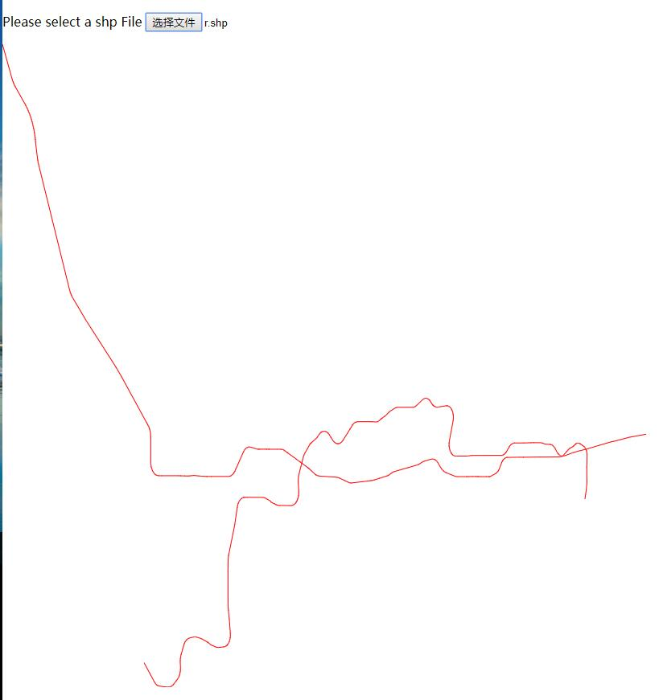
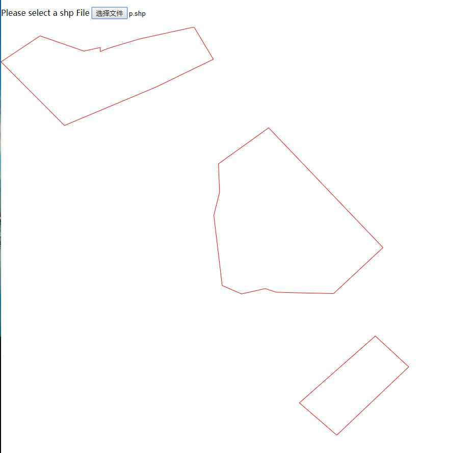

shapefile_js
=========

This project allows user to read shapefile with Javascript, 
It has supported almost all types of shapefiles although 
which was composed of 200 lines code.

A live example can be found at
https://polluxll.github.com/shapefile_js/index.html

### Support shape type

+ Point
+ PointZ
+ PointM
+ MultiPoint
+ MultiPointZ
+ MultiPointM
+ Polyline
+ PolylineZ
+ PolylineM
+ Polygon
+ PolygonZ
+ PolygonM

### Resources

> [ESRI Shapefile Technical Description - PDF](http://www.esri.com/library/whitepapers/pdfs/shapefile.pdf)

### Samples

